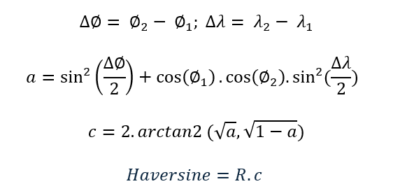
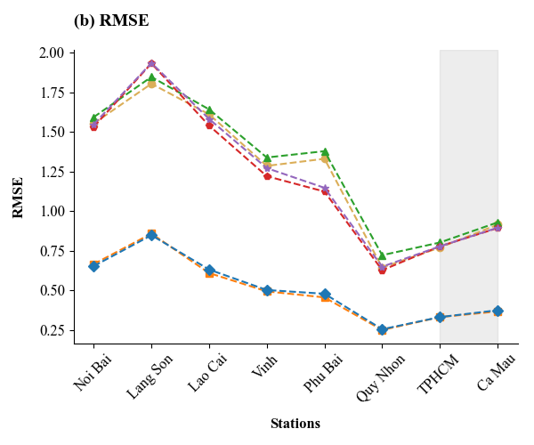

# Applying deep learning models to apparent temperature forecasting in Vietnam
 
In recent years, Vietnam has been experiencing an alarming increase in heatwaves and severe cold spells that persist for several consecutive days. These extreme events are matters of concern as they affect human health through apparent temperature – an indication that reflects the degree to which the human body actually feels hot or cold, under the combined influence of factors such as air temperature, dew point and wind speed. This  project focuses on improving accuracy in apparent temperature forecasting in Vietnam by exploiting spatio – temporal relationships in meteorological dataset. Specifically, we propose a hybrid model which combines customized Graph Convolutional Network (GCN) with variants of Long short – term memory (LSTM), along with the Attention mechanism. This proposed method includes two phases: data preprocessing as input to the model and model development. In the data preprocessing phase, the datasets are normalized, transformed into a time series format using the sliding window technique. The model development phase primarily focuses on the model architecture and its training process, along with the optimization of its hyperparameters. This study trains and evaluates the proposed model based on apparent temperature dataset which was collected from 8 meteorological stations representing different regions across Vietnam between 1992 and 2024. The efficiency of the proposed model is compared with traditional methods, such as LSTM variants that focus on temporal features, as well as simple models that capture spatio-temporal relationships. Experimental results demonstrate that the proposed method significantly outperforms baseline models in forecasting apparent temperature across all stations in the three main regions of Vietnam, achieving a coefficient of determination (R²) of approximately 93 – 99% for forecasting the mean apparent temperature and 90 – 98% for forecasting the maximum apparent temperature at a single time step.

## Authors
- [@NgocHuynhTuyet0308](https://github.com/NgocHuynhTuyet0308)
- [@BuiHuuDatSGUK21](https://github.com/BuiHuuDatSGUK21)

## Data description
The dataset used in this study was collected from the Meteostat Developers API (https://dev.meteostat.net/), which compiles datasets from worldwide meteorological stations, mostly derived from trustworthy governmental agencies like the National Oceanic and Atmospheric Administration (NOAA), with the following geographical distribution:

- **Northern Vietnam**: Noi Bai Station (Red River Delta), Lang Son Station (Northeastern region), and Lao Cai Station (Northwestern region).
- **Central Vietnam**: Vinh and Phu Bai Stations (North Central Coast) and Quy Nhon (South Central Coast).
- **Southern Vietnam**: Ho Chi Minh City Station (Southeast region) and Ca Mau Station (Mekong Delta).

| Weather Station     | Longitude | Latitude |
|--------------------|-----------|----------|
| Noi Bai             | 105.81    | 21.22    |
| Lang Son            | 106.767   | 21.833   |
| Lao Cai             | 103.967   | 22.5     |
| Vinh                | 105.67    | 18.74    |
| Phu Bai             | 107.7     | 16.4     |
| Quy Nhon            | 109.22    | 13.77    |
| Ho Chi Minh City    | 106.65    | 10.82    |
| Ca Mau              | 105.15    | 9.183    |

| Feature                          | Description                                  | Unit   |
|----------------------------------|----------------------------------------------|--------|
| Time Features                    | Day, Month, Year                            | -      |
| Geographic Features              | Longitude, Latitude                        | Degrees|
| Air Temperature (2m)             | Air temperature measured at 2 meters       | °C     |
| Dew Point Temperature (2m)       | Dew point temperature at 2 meters          | °C     |
| Relative Humidity                | Relative humidity                          | %      |
| Apparent Temperature (Mean & Max) | Daily mean and maximum apparent temperature | °C  |

## Proposed method
Based on this data analysis process, we realize that the apparent temperature is affected by spatial interactions between different stations. The closer the stations are geographically, the more similar their apparent temperature variations become over seasonal, monthly, and annual timescales.

Furthermore, the variation of apparent temperature in Southern Vietnam from 1992 to 2024 (32 years) shows an increasing trend with very small temperature amplitudes, and does not exhibit any clear cyclical or repetitive pattern as observed in the stations of Northern and Central Vietnam.

For that reason, we propose an LSTM/BiLSTM model combined with a customized GCN and multi-head attention mechanism to predict the future daily mean and maximum apparent temperatures based on past data. 

- **Prepare data for proposed model**

  

- **The process of building proposed model**

  

- **Input parameters of the proposed model**

| Parameter             | Value | Description                   |
|----------------------|-------|-------------------------------|
| Batch_size            | 16    | Batch size                    |
| Input_sequence_length | 31    | Input sequence length         |
| In_feat               | 1     | Number of input features      |
| Num_nodes             | 8     | Number of nodes (weather stations) |
| Out_feat              | 32    | Embedding size                |

- **Graph structure**

The table below is created based on apparent temperature correlation among these stations. We set a threshold of 0.5, meaning that a pair of stations is considered connected if their correlation value is greater than or equal to 0.5.

Note: In this table, the value 1 represents the existence of a connection between two weather stations, and the value 0 indicates that there is no connection between them. 

| Station   | Noi Bai | Lang Son | Lao Cai | Vinh | Phu Bai | Quy Nhon | Ho Chi Minh City | Ca Mau |
|-----------|---------|----------|---------|------|---------|----------|------------------|--------|
| Noi Bai   | 0       | 1        | 1       | 1    | 1       | 1        | 0                | 0      |
| Lang Son  | 1       | 0        | 1       | 1    | 1       | 1        | 0                | 0      |
| Lao Cai   | 1       | 1        | 0       | 1    | 1       | 1        | 0                | 0      |
| Vinh      | 1       | 1        | 1       | 0    | 1       | 1        | 0                | 0      |
| Phu Bai   | 1       | 1        | 1       | 1    | 0       | 1        | 0                | 0      |
| Quy Nhon  | 1       | 1        | 1       | 1    | 1       | 0        | 0                | 0      |
| HCMC      | 0       | 0        | 0       | 0    | 0       | 0        | 0                | 1      |
| Ca Mau    | 0       | 0        | 0       | 0    | 0       | 0        | 1                | 0      |

- **Output parameters of the proposed model**

 Parameter             | Value | Description                   |
|----------------------|-------|-------------------------------|
| Batch_size            | 16    | Batch size                    |
| Num_nodes | 8    | Number of nodes (weather stations)         |
| Forecast_horizon               | 1     | The number of time steps into the future that the model is designed to forecast      |

- **The architecture of the proposed model**

  

| **Layer**                   | **Input Shape**             | **Output Shape**            |
| --------------------------- | --------------------------- | --------------------------- |
| Input                       | \[B, I, N, In\_feat]        | -                           |
| GCN  *(with input reshape)* | \[N, B, I, In\_feat]        | \[N, B, I, Out\_feat]       |
| Reshape 1                   | \[N, B, I, Out\_feat]       | \[N × B, I, Out\_feat]      |
| LSTM                        | \[N × B, I, Out\_feat]      | \[N × B, LSTM\_unit]        |
| Reshape 2                   | \[N × B, LSTM\_unit]        | \[B, N, attention\_unit]    |
| Multi-Head Attention        | \[B, N, attention\_unit]    | \[B, N, attention\_unit]    |
| Reshape 3                   | \[B, N, attention\_unit]    | \[B × N, attention\_unit]   |
| Dense output                | \[B × N, attention\_unit]   | \[B × N, forecast\_horizon] |
| Reshape 4                   | \[B × N, forecast\_horizon] | \[N, B, forecast\_horizon]  |
| Output                      | \[N, B, forecast\_horizon]  | \[B, N, forecast\_horizon]  |

| **Hyperparameter**           | **Value** | 
| ---------------------------- | --------- |
| Number of GCN layers         | 1 (Aggregation type: sum; combination type: concat; activation function: tanh)        |
| Number of LSTM/BiLSTM layers | 1 (Unit: 256; activation function: tanh)      |
| Number of Attention layers | 1 (Head: 4; Key dimension: 32; Dropout: 0.1)      |
| Number of Dense layers       | 1         |
| Number of Dropout layers     | 0         |
| Optimizer                    | Adam      |
| Learning rate                | 0.0001    |
| Norm clipping                | 1         |
| Loss function                | MSE       |
| Patience (Early Stopping)    | 10        |

- **The custom GCN layer**

In the proposed model, the GCN layer still utilizes an adjacency matrix built from the apparent temperature correlation between weather stations. However, we introduce a key improvement by integrating geographical coordinates (latitude and longitude) of the stations.

**Create Haversine distance matrix**: We calculate the pairwise distances between stations using the Haversine formula, which computes the great-circle distance on the Earth's surface:

  
  

**Create distance-based edge weights with Gaussian Kerner**: For each edge (i, j), we assign a distance-based weight using a Gaussian kernel

  

**Weighted message aggregation in GCN**: During message aggregation (Stage 2) of GCN, we incorporate the distance weights then aggregate all weighted messages from neighbors

  
  

## Baseline models for comparison
We compare the performance of our proposed model with two baseline models:

 - **Baseline 1: Stacked LSTM / BiLSTM**: A standard stacked LSTM/BiLSTM model that addresses the problem as a multi-task time series forecasting task (one task per station).

**Input parameters of the baseline 1 model**

 | Parameter                 | Value | Description                  |
| ------------------------- | ----- | ---------------------------- |
| Batch size                | 64/ 8    | Batch size (64 for Northern and Central stations; 8 for Southern stations)              |
| Input sequence length     | 31    | Length of the input sequence |
| Input features (In\_feat) | 6     | Number of input features     |

**Output parameters of the baseline 1 model**

| Parameter        | Value | Description                                 |
| ---------------- | ----- | ------------------------------------------- |
| Batch size       | 64    | Batch size                                  |
| Forecast horizon | 1     | Number of future time steps to be predicted |
| Output features  | 2     | Number of target features to predict        |

**The architecture of the baseline 1 model**

| Layer            | Input Shape                 | Output Shape                |
| ---------------- | --------------------------- | --------------------------- |
| Input            | \[B, I, In\_feat]           | -                           |
| LSTM 1           | \[B, I, In\_feat]           | \[B, I, LSTM\_unit]         |
| LSTM 2           | \[B, I, LSTM\_unit]         | \[B, I, LSTM\_unit // 2]    |
| LSTM 3           | \[B, I, LSTM\_unit // 2]    | \[B, LSTM\_unit // 4]       |
| Dense            | \[B, LSTM\_unit // 4]       | \[B, Dense\_unit]           |
| Dense Output     | \[B, Dense\_unit]           | \[B, forecast\_horizon × 2] |
| Output (reshape) | \[B, forecast\_horizon × 2] | \[B, forecast\_horizon, 2]  |

| Hyperparameter            | Value      |
| ------------------------- | ---------- |
| Model initialization      | Sequential |
| Number of LSTM layers     | 3          |
| Number of Dense layers    | 2          |
| Number of Dropout layers  | 3          |
| LSTM/ BiLSTM 1 | (Unit: 256; activation function: tanh)         |
| LSTM/ BiLSTM 2 | (Unit: 128; activation function: tanh)         |
| LSTM/ BiLSTM 3 | (Unit: 64; activation function: tanh)         |
| Optimizer                 | Adam       |
| Learning rate             | 0.0001     |
| Norm clipping             | 1          |
| Loss function             | MSE        |
| Patience (Early Stopping) | 10         |

 
 - **Baseline 2: GCN-LSTM / BiLSTM (Unmodified Version)**: A GCN-LSTM/BiLSTM model that uses the original graph structure without spatial distance weighting. This model directly applies existing GCN-LSTM implementations from previous works, using the same adjacency matrix as our method but without any spatial fine-tuning or custom aggregation.

**The architecture of the baseline 2 model**

 | Layer              | Input Shape                 | Output Shape                |
| ------------------ | --------------------------- | --------------------------- |
| Input              | \[B, I, N, In\_feat]        | -                           |
| GCN (with reshape) | \[N, B, I, In\_feat]        | \[N, B, I, Out\_feat]       |
| Reshape 1          | \[N, B, I, Out\_feat]       | \[N × B, I, Out\_feat]      |
| LSTM               | \[N × B, I, Out\_feat]      | \[N × B, LSTM\_unit]        |
| Dense output       | \[N × B, LSTM\_unit]        | \[N × B, forecast\_horizon] |
| Reshape 2          | \[N × B, forecast\_horizon] | \[N, B, forecast\_horizon]  |
| Output             | \[N, B, forecast\_horizon]  | \[B, N, forecast\_horizon]  |

| Hyperparameter               | Value  |
| ---------------------------- | ------ |
| Number of GCN layers         | 1 (Aggregation type: sum; combination type: concat; activation function: tanh)     |
| Number of LSTM/BiLSTM layers | 1 (Unit: 256; activation function: tanh)     |
| Number of Dense layers       | 1      |
| Number of Dropout layers     | 0      |
| Optimizer                    | Adam   |
| Learning rate                | 0.0001 |
| Norm clipping                | 1      |
| Loss function                | MSE    |
| Patience (Early Stopping)    | 10     |

## Results

- **Forecast the mean apparent temperature**

  

  
  
  

- **Forecast the maximum apparent temperature**

  

  
  
  

